

	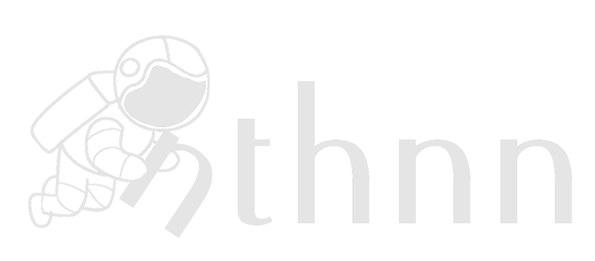

# 🚀 Hi, I'm [nthnn](https://nthnn.github.io)!

    

Hello, world! I am Nathanne Isip, an error-prone mammal and a dynamic yet versatile persona deeply imbued with an ardent ardor for the realm of technology, specifically encompassing the domains of web development, software engineering, embedded systems, and the creation of mobile applications.

In the capacity of a diligent scholar, I am presently engaged in the pursuit of a distinguished Bachelor of Science degree in the realm of Computer Science, driven by an ambitious vision to emerge as a vanguard influence in the ever-evolving tapestry of contemporary technological advancement. Amidst this intellectual odyssey, my ambitions soar far beyond the mere acquisition of knowledge. The aspiration to stand as a trailblazing force in the realm of modern technology that fuels my endeavors.

	

## 🧬 Skills

I possess a versatile skill set in mobile app development, web development, and software engineering. Here are the icon grid of languages, frameworks, technologies, and IDEs I use.

	<a href="https://learn.microsoft.com/en-us/dotnet/csharp/">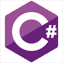</a>
	
	<a href="https://www.java.com/en/">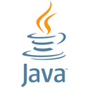</a>
	<a href="https://kotlinlang.org">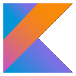</a>
	
	
	
	
	
	 
	<a href="https://ballerina.io">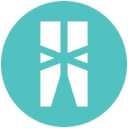</a>
	<a href="https://jupyter.org">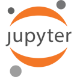</a>
	
	
	
	
	
	
	
	 
	
	<a href="https://cplusplus.com/">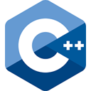</a>
	
	
	
	
	
	
	
	 
	
	
	<a href="https://babeljs.io/">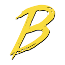</a>
	
		<a href="https://postcss.org/">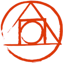</a>
	
	
	
	 
	
	
	
	
	
	
	
	<a href="https://phaser.io/">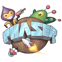</a>
	
	 
	<a href="https://www.arduino.cc">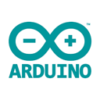</a>
	
	
	
	
	
	
	
	
	 
	
	
	
	<a href="https://www.bloodshed.net">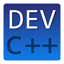</a>

## 📈 My GitHub Stats

	
	
	 
	

## My Projects

- [n2cmu](https://github.com/nthnn/n2cmu) - Feedforward Neural Network Coprocessing Microcontroller Unit (CPC via UART) for STM32F103C8T6 Bluepill Development Board written purely in TinyGo.
- [diwa](https://github.com/nthnn/diwa) - Lightweight simple implementation of Artificial Neural Network for Arduino ESP32, ESP8266, RP2040, PlayStation Portable SDK, WebAssembly, and even Windows, macOS, and Linux-based OSes.
- [tomo](https://github.com/nthnn/tomo) - An AI-like handheld interactable full of emotion companion pet made with ESP32 NodeMCU via Arduino Platform.
- [rishka](https://github.com/nthnn/rishka) - RISC-V core virtual runtime written in C/C++ (Arduino platform) intended for ESP32-WROVER with PSRAM.
- [minbox](https://github.com/nthnn/minbox) - Minbox is a simple, minimalistic command-line tool written in Rust, inspired by BusyBox. Made to learn Rust programming language.
- [ladivic](https://github.com/nthnn/ladivic) - C++ library designed to provide system-level thread- and fail-safe functions with concurrency, atomic, file I/O, IPC, memory management, and system information retrieval functionalities.
- [medium](https://github.com/nthnn/medium) - My GitHub repository collection of Medium blogs, articles, and related content blogs, articles, and such.
- [rheolaeth](https://github.com/nthnn/rheolaeth) - Rheolaeth is a remote tool for controlling shell via HTTP connection using another device in network.
- [Qrepo](https://github.com/nthnn/Qrepo) - Simple and easy-to-use all-for-one build tool for Windows, Linux, and macOS.
- [Zync-OS](https://github.com/nthnn/Zync-OS) - Mock-up bootloader and kernel-only operating system with a very basic boring shell written in pure Assembly.
- [wtfC](https://github.com/nthnn/wtfC) - Playful language extension for C and C++ that introduces unconventional and humorous macros aims to add a touch of creativity.
- [microlzw](https://github.com/nthnn/microlzw) - Embeddable micro Lempel-Ziv-Welch compression library for strings.
- [astroclock](https://github.com/nthnn/astroclock) - Cute desktop date and time display with Arduino Nano and monochromatic SH1106.
- [QLBase](https://github.com/nthnn/QLBase) - Decentralizable, scalable, and reliable backend solution alternative to traditional NoSQL, SaaS, and cloud-based services.
- [AnkoWeb](https://github.com/nthnn/AnkoWeb) - Versatile scripting language and middleware designed for web development, running on the Anko virtual machine.
- [Jessy-OS](https://github.com/nthnn/Jessy-OS) - Embedded Operating System for ESP32 microcontroller unit that runs JavaScript via Duktape.
- [SIM900](https://github.com/nthnn/SIM900) - A much more comprehensive library for Arduino SIM900 shield.
- [Planet096](https://github.com/nthnn/Planet096) - SSD1306-based Monochromatic GUI library for OLED 0.96" inch (128x64 pixels) display in Arduino.
- [yttria-lang](https://github.com/nthnn/yttria-lang) - Yttria programming language using LLVM bindings in pure TypeScript.
- [Brillo-8](https://github.com/nthnn/Brillo-8) - A programmable pocket computer with an embedded virtual machine.
- [Hopia](https://github.com/nthnn/Hopia) - Hopia is a powerful and versatile wannabe penetration testing tool designed for ethical and legitimate security testing purposes.
- [PortaMob](https://github.com/nthnn/PortaMob) - Portable Mobile device-like shield for UNO-like boards; an ingenious extension for the Arduino UNO platform.
- [TCS3200](https://github.com/nthnn/TCS3200) - Comprehensive Arduino library for TCS3200 color sensor.
- [Monitoria](https://github.com/nthnn/Monitoria) - Advance attendance monitoring system with ESP8266 NodeMCU, RFID-RC522, SIM800L, LCD I2C, and a custom web application.
- [VoxHAUT-Roamer](https://github.com/nthnn/VoxHAUT-Roamer) - Interactive companion pet robot on ESP8266 (Arduino) with Android phone app for communication.
- [MaskUp](https://github.com/nthnn/MaskUp) - Simple program that can identify if an individual is wearing a face mask.
- [Navigador](https://github.com/nthnn/Navigador) - Arduino library for dual DC motor navigation.
- [Anomalia](https://github.com/nthnn/Anomalia) - Arduino library for data processing anomalies.
- [PH4502C-Sensor](https://github.com/nthnn/PH4502C-Sensor) - Comprehensive and easy-to-use Arduino library for PH4502C pH level and temperature sensor.
- [VizhPort](https://github.com/nthnn/VizhPort) - A Python program to monitor the serial port with PyQTGraph's visualization.
- [Recognito](https://github.com/nthnn/Recognito) - Mini-silly image classifier UI with tensorflow and PyQT5.
- [Arduquarium](https://github.com/nthnn/Arduquarium) - Automated aquarium recycling with Arduino UNO.
- [Batch2Exe](https://github.com/nthnn/Batch2Exe) - Easy-to-use Windows Batch File to executable file converter/wrapper with Swing GUI.
- [Fakfak-Bird-OLED](https://github.com/nthnn/Fakfak-Bird-OLED) - A fun Flappy Bird-like game in Arduino Nano
- [Mussicini](https://github.com/nthnn/Musiccini) - Arduino Ultra-lightweight Music Synthesis Library
- [j9n8.github.io](https://github.com/J9N8/j9n8.github.io) - J9N8's Official Website
- [UrPh News](https://github.com/nthnn/UrPh-News) - Minimalistic news outlet Android app.
- [nougat-lang](https://github.com/nthnn/nougat-lang) - An obsolete dynamic scripting yet general-purpose programming language for absolutely nothing written in C#.
- [Lanzaplicacion](https://github.com/nthnn/Lanzaplicacion) - Android launcher with a super minimalist and primitive-looking UI.
- [OTG-Nilboard](https://github.com/nthnn/OTG-Nilboard) - Android smartphone app to suppress the default keyboard.
