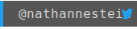
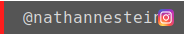

	

# Hi, I'm [nthnn](https://nthnn.github.io)!

	
	

Hello, world! I am Nathanne Isip. I am a multifaceted individual with a passion for technology, specifically web development, software engineering, and mobile app development. As a student, I am currently pursuing a Bachelor of Science degree in Computer Science, with the aspiration of becoming a pioneering force in modern technology.

## 🧬 Skills

Software development, Android app development, web development (front-end and server-side), and Arduino firmware sketching.

	
	
	
	
	
	
	 
	
	
	
	
	
	
	 
	
	
	
	
	
	
	 
	
	
	
	
	
	
	 
	
	
	
	
	
	

## 📈 My GitHub Stats

	
	
	

