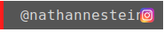
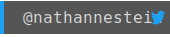

	

# Howdy! I'm [nthnn](https://nthnn.github.io).

I am a student, full-stack develop, software engineer, mobile app developer, web developer, and an embedded system hobbyist.

	
	

## 👨‍💻 About Me

Hello, world! I am Nathanne Isip. A student currently studying BS Computer Science. I am aspiring to be one of the future modern technology pioneers.

## 🧬 Skills

Software development, Android app development, web development (front-end and server-side), and Arduino firmware sketching.

                    

My additional skills are PCB designing, Photoshop, 2D game map editing with TileMap, and Googling.

## 📈 My GitHub Stats

	
	

