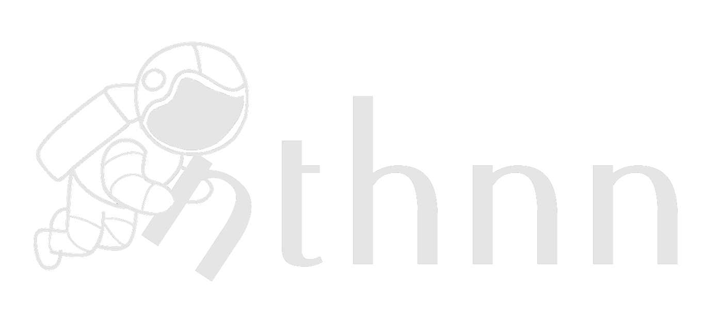

	

	 

# Hi, I'm [nthnn](https://nthnn.github.io)!

    

I'm an all-around technology architect in Software Engineering and Mobile/Web Development, specializing in Generative AI/MLOps, Cloud Edge Computing, and Blockchain/Web3.

## My Projects

- [earnmore](https://github.com/nthnn/earnmore) - Zero-dependency, cryptographically secure Node.js library engineered for issuing, validating, and managing closed-loop reward and gift card networks.
- [augre](https://github.com/nthnn/augre) - Augre is a powerful, drop-in replacement for Supabase's postgrest-js database SDK.
- [secret_pii_finder](https://github.com/nthnn/secret_pii_finder) - Security toolset and AI skill for identifying, masking, and remediating hardcoded credentials, API keys, and sensitive PII within software repositories.
- [middle](https://github.com/nthnn/middle) - Jupyter-first toolkit for quickly brewing, testing, and cloning Ollama-based large language model personalities.
- [purple](https://github.com/nthnn/purple) - Comprehensive library for system core server-side stack for robust, scale-able, and high-performance system applications in pure C++.
- [rhea](https://github.com/rhea-language/rhea) - Just-In-Time-compiled dynamic general-purpose programming language utilizing OpenMP parallelism with built-in & language-level concurrency and unconventional syntax expressiveness.
- [risbee](https://github.com/nthnn/risbee) - Small, self-contained virtual machine that draws inspiration from the RISC-V instruction set that offers a simple and approachable way to experiment with low-level concepts like registers, memory management, and instruction decoding.
- [mvs](https://github.com/nthnn/mvs) - Lightweight version control system written in Go. MVS provides basic init, add, remove, commit, log, branch, checkout, status, and tree commands, with msgpack metadata, Ed25519 signatures for tamper-evident history, and global configuration via YAML.
- [Glasgow](https://github.com/nthnn/Glasgow) - A flexible, modular, and lightweight .NET library designed to simplify the development of in-memory databases, data manipulation engines, and query interpreters.
- [xbin25](https://github.com/nthnn/xbin25) - Go package designed for secure data serialization, combining state-of-the-art encryption, digital signatures, and multi-layer compression ensuring confidentiality, integrity, and authenticity.
- [rivescript-vsce](https://github.com/nthnn/rivescript-vsce) - A Visual Studio Code extension that elevates your RiveScript development workflow by combining robust syntax support with an integrated chat interface with syntax highlighting, language-aware editing features, and a live preview panel.
- [noko](https://github.com/nthnn/noko) - User-friendly Godot plugin that facilitates seamless interaction with Ollama models via API that empowers developers to enhance their games with interactive Large Language Models (LLMs), enabling dynamic dialogues, intelligent NPCs, and more.​
- [gh-backer](https://github.com/nthnn/gh-backer) - A tool to back up all your GitHub repositories—personal and organizational—while generating an elegant HTML profile overview.
- [gdscript-vsce](https://github.com/nthnn/gdscript-vsce) - VS Code extension to help developers write and manage GDScript scripts more effectively by offering enhanced code readability through proper syntax highlighting.
- [golloom](https://github.com/nthnn/golloom) - Robust Go library designed to facilitate seamless integration and interaction with language models with model management, prompt generation, process monitoring, and version retrieval using Ollama.
- [Ura](https://github.com/nthnn/ura) - Ura provides a full suite of banking features—including user management, loan handling, payment transactions, session management, and more—designed with industry best practices for security, performance, and scalability.
- [quoneq](https://github.com/nthnn/quoneq) - Lightweight, multi-protocol networking library for C++ that provides a simple, unified API for a variety of network protocols based on libcurl developed specially for [Rhea programming language](https://github.com/rhea-language/rhea).
- [chisei](https://github.com/nthnn/chisei) - A lightweight, efficient, and user-friendly C++ library for creating, training, and deploying fully connected neural networks; designed with simplicity and performance in mind.
- [unsafe_ops](https://github.com/nthnn/unsafe_ops) - Low-level utility library designed to provide direct access to hardware and memory operations for embedded systems, operating systems, and performance-critical applications where low-level control and performance optimization are crucial.
- [oniontalk](https://github.com/nthnn/oniontalk) - A secure, end-to-end encrypted chat application designed for deployment on the TOR Network as an onion service with room-based conversations with encrypted messaging, user presence tracking, and typing indicators.
- [Ambassador](https://github.com/nthnn/Ambassador) - Java lightweight, high-performance web framework designed for building scalable and efficient web applications with robust support for database management, middleware integration, routing, and asynchronous execution.
- [QLBase](https://github.com/nthnn/QLBase) - Decentralizable, scalable, and reliable backend solution alternative to traditional NoSQL, SaaS, and cloud-based services.
- [MyShell](https://github.com/nthnn/MyShell) - A modern C++ library that provides a robust, cross-platform interface for shell process interaction that allows seamless execution and interaction with shell commands across Windows, Linux, and macOS operating systems.
- [QuickDigest5](https://github.com/nthnn/QuickDigest5) - A lightweight C++ library for computing MD5 hashes of strings and files. Designed for simplicity and efficiency, it provides static utility methods to generate MD5 hashes and convert them to hexadecimal string representations.
- [sConf](https://github.com/nthnn/sConf) - sConf is a lightweight and flexible C++ library for parsing, managing, and manipulating structured configuration files.
- [dna_sequence_identification](https://github.com/nthnn/dna_sequence_identification) - DNA sequence classification AI is based on the dataset from the archive of UC Irvine Machine Learning Repository using Random Forest Classification algorithm.
- [brainfuck-assembly](https://github.com/nthnn/brainfuck-assembly) - Brainfuck Assembly is a human-readable assembly language to simplify the process of writing Brainfuck programs.
- [offion](https://github.com/nthnn/offion) - Debian-based personal browser built with Electron framework, integrating Tor for enhanced privacy and anonymous browsing.
- [goblin3d](https://github.com/nthnn/goblin3d) - Graphics engine for rendering 3D wireframe on monochromatic displays and TFT LCDs without any dependency required for Arduino platform. 
- [C3E](https://github.com/nthnn/c3e) - C3E (Complex Compute Core Engine) is a framework, platform, library, and an engine for handling complex computational tasks involving matrices, vectors, and tensors.
- [Feihua](https://github.com/nthnn/Feihua) - Feihua is an anti-virus/anti-malware program that verifies file hashes against the VirusShare.com database for Windows systems.
- [mdif](https://github.com/nthnn/mdif) - Minimal Data Image Format (MDIF) is a lightweight image format with minimal data structure and integration with Diwa in mind that balances both simplicity and functionality.
- [tasuke](https://github.com/nthnn/tasuke) - Customizable personal computer assistant that utilizes AI voice command recognition to help automate tasks and provide a more interactive computing experience.
- [uartix-vsce](https://github.com/nthnn/uartix-vsce) - Uartix Syntax Highlighting for Visual Studio Code extension that provides syntax highlighting for the Uartix programming language.
- [Uartix](https://github.com/nthnn/Uartix) - Strange dynamic programming and scripting language that performs mathematical computations on a connected Raspberry Pi Pico (RP2040) through UART connectivity.
- [DynaConfig](https://github.com/nthnn/DynaConfig) - Arduino WiFi dynamic configuration library for ESP32 using captive portal authentication.
- [rust-rp2040](https://github.com/nthnn/rust-rp2040) - A starting point for developing embedded Rust applications on Raspberry Pi Pico, featuring Cargo configurations, UF2 memory mapping, and basic LED blinking example.
- [NateOS](https://github.com/nthnn/NateOS) - NateOS: My own lightweight Linux-based OS distribution, created for enjoyment and personal experimentation.
- [NoOS](https://github.com/nthnn/NoOS) - NoOS (No Operating System) is an attempt unikernel framework for developing programs in C++ without OS.
- [n2cmu](https://github.com/nthnn/n2cmu) - Feedforward Neural Network Coprocessing Microcontroller Unit (CPC via UART) for STM32F103C8T6 Bluepill Development Board written purely in TinyGo.
- [n2cmu-arduino](https://github.com/nthnn/n2cmu-arduino) - This is the official Arduino library for N2CMU (Neural Network Coprocessing Microcontroller Unit) available on Arduino Package Manager and PlatformIO.
- [diwa](https://github.com/nthnn/diwa) - Lightweight simple implementation of Artificial Neural Network for Arduino ESP32, ESP8266, RP2040, PlayStation Portable SDK, WebAssembly, and even Windows, macOS, and Linux-based OSes.
- [tomo](https://github.com/nthnn/tomo) - An AI-like handheld interactable full of emotion companion pet made with ESP32 NodeMCU via Arduino Platform.
- [rishka](https://github.com/nthnn/rishka) - RISC-V core virtual runtime written in C/C++ (Arduino platform) intended for ESP32-WROVER with PSRAM.
- [minbox](https://github.com/nthnn/minbox) - Minbox is a simple, minimalistic command-line tool written in Rust, inspired by BusyBox. Made to learn Rust programming language.
- [ladivic](https://github.com/nthnn/ladivic) - C++ library designed to provide system-level thread- and fail-safe functions with concurrency, atomic, file I/O, IPC, memory management, and system information retrieval functionalities.
- [rheolaeth](https://github.com/nthnn/rheolaeth) - Rheolaeth is a remote tool for controlling shell via HTTP connection using another device in network.
- [Qrepo](https://github.com/nthnn/Qrepo) - Simple and easy-to-use all-for-one build tool for Windows, Linux, and macOS.
- [Zync-OS](https://github.com/nthnn/Zync-OS) - Mock-up bootloader and kernel-only operating system with a very basic boring shell written in pure Assembly.
- [wtfC](https://github.com/nthnn/wtfC) - Playful language extension for C and C++ that introduces unconventional and humorous macros aims to add a touch of creativity.
- [microlzw](https://github.com/nthnn/microlzw) - Embeddable micro Lempel-Ziv-Welch compression library for strings.
- [astroclock](https://github.com/nthnn/astroclock) - Cute desktop date and time display with Arduino Nano and monochromatic SH1106.
- [AnkoWeb](https://github.com/nthnn/AnkoWeb) - Versatile scripting language and middleware designed for web development, running on the Anko virtual machine.
- [Jessy-OS](https://github.com/nthnn/Jessy-OS) - Embedded Operating System for ESP32 microcontroller unit that runs JavaScript via Duktape.
- [SIM900](https://github.com/nthnn/SIM900) - A much more comprehensive library for Arduino SIM900 shield.
- [Planet096](https://github.com/nthnn/Planet096) - SSD1306-based Monochromatic GUI library for OLED 0.96" inch (128x64 pixels) display in Arduino.
- [yttria-lang](https://github.com/nthnn/yttria-lang) - Yttria programming language using LLVM bindings in pure TypeScript.
- [Brillo-8](https://github.com/nthnn/Brillo-8) - A programmable pocket computer with an embedded virtual machine.
- [Hopia](https://github.com/nthnn/Hopia) - Hopia is a powerful and versatile wannabe penetration testing tool designed for ethical and legitimate security testing purposes.
- [PortaMob](https://github.com/nthnn/PortaMob) - Portable Mobile device-like shield for UNO-like boards; an ingenious extension for the Arduino UNO platform.
- [TCS3200](https://github.com/nthnn/TCS3200) - Comprehensive Arduino library for TCS3200 color sensor.
- [Monitoria](https://github.com/nthnn/Monitoria) - Advance attendance monitoring system with ESP8266 NodeMCU, RFID-RC522, SIM800L, LCD I2C, and a custom web application.
- [VoxHAUT-Roamer](https://github.com/nthnn/VoxHAUT-Roamer) - Interactive companion pet robot on ESP8266 (Arduino) with Android phone app for communication.
- [MaskUp](https://github.com/nthnn/MaskUp) - Simple program that can identify if an individual is wearing a face mask.
- [Navigador](https://github.com/nthnn/Navigador) - Arduino library for dual DC motor navigation.
- [Anomalia](https://github.com/nthnn/Anomalia) - Arduino library for data processing anomalies.
- [PH4502C-Sensor](https://github.com/nthnn/PH4502C-Sensor) - Comprehensive and easy-to-use Arduino library for PH4502C pH level and temperature sensor.
- [VizhPort](https://github.com/nthnn/VizhPort) - A Python program to monitor the serial port with PyQTGraph's visualization.
- [Recognito](https://github.com/nthnn/Recognito) - Mini-silly image classifier UI with tensorflow and PyQT5.
- [Arduquarium](https://github.com/nthnn/Arduquarium) - Automated aquarium recycling with Arduino UNO.
- [Batch2Exe](https://github.com/nthnn/Batch2Exe) - Easy-to-use Windows Batch File to executable file converter/wrapper with Swing GUI.
- [Fakfak-Bird-OLED](https://github.com/nthnn/Fakfak-Bird-OLED) - A fun Flappy Bird-like game in Arduino Nano
- [Mussicini](https://github.com/nthnn/Musiccini) - Arduino Ultra-lightweight Music Synthesis Library
- [j9n8.github.io](https://github.com/J9N8/j9n8.github.io) - J9N8's Official Website
- [UrPh News](https://github.com/nthnn/UrPh-News) - Minimalistic news outlet Android app.
- [nougat-lang](https://github.com/nthnn/nougat-lang) - An obsolete dynamic scripting yet general-purpose programming language for absolutely nothing written in C#.
- [Lanzaplicacion](https://github.com/nthnn/Lanzaplicacion) - Android launcher with a super minimalist and primitive-looking UI.
- [OTG-Nilboard](https://github.com/nthnn/OTG-Nilboard) - Android smartphone app to suppress the default keyboard.
