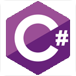

	

# 🚀 Hi, I'm [nthnn](https://nthnn.github.io)!

     

Hello, world! I am Nathanne Isip. I am a multifaceted individual with a passion for technology, specifically web development, software engineering, and mobile app development. As a student, I am currently pursuing a Bachelor of Science degree in Computer Science, with the aspiration of becoming a pioneering force in modern technology.

## 🧬 Skills

I possess a versatile skill set in mobile app development, web development, and software engineering. Here are the icon grid of languages, frameworks, technologies, and IDEs I use.

	
	
	
	
	
	
	 
	
	
	
	
	
	
	 
	
	
	
	
	
	
	 
	
	
	
	
	
	
	 
	
	
	
	
	
	
	 
	
	
	
	
	
	

## 📈 My GitHub Stats

	
	
	 
	

