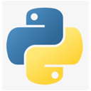
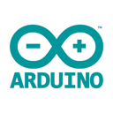
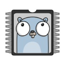
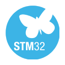

	

# 🚀 Hi, I'm [nthnn](https://nthnn.github.io)!

    

Hello, world! I am Nathanne Isip, an error-prone mammal and a dynamic yet versatile persona deeply imbued with an ardent ardor for the realm of technology, specifically encompassing the domains of web development, software engineering, embedded systems, and the creation of mobile applications.

	 

## 🧬 Skills

I possess a versatile skill set in mobile app development, web development, and software engineering. Here are the icon grid of languages, frameworks, technologies, and IDEs I use.

	
	
	
	
	
	
	
	
	
	 
	
	
	
	
	
	
	
	
	
	 
	
	
	
	
	
	
	
	
	
	 
	
	
	
	
	
		
	
	
	 
	
	
	
	
	
	
	
	
	
	 
	
	
	
	
	
	
	
	
	
	 
	
	
	
	
	
	
	

## 📈 My GitHub Stats

	
	
	 
	

## My Projects

- [QLBase](https://github.com/nthnn/QLBase) - Decentralizable, scalable, and reliable backend solution alternative to traditional NoSQL, SaaS, and cloud-based services.
- [MyShell](https://github.com/nthnn/MyShell) - A modern C++ library that provides a robust, cross-platform interface for shell process interaction that allows seamless execution and interaction with shell commands across Windows, Linux, and macOS operating systems.
- [QuickDigest5](https://github.com/nthnn/QuickDigest5) - A lightweight C++ library for computing MD5 hashes of strings and files. Designed for simplicity and efficiency, it provides static utility methods to generate MD5 hashes and convert them to hexadecimal string representations.
- [sConf](https://github.com/nthnn/sConf) - sConf is a lightweight and flexible C++ library for parsing, managing, and manipulating structured configuration files.
- [n8](https://github.com/nthnn/n8) - Just-In-Time-compiled dynamic general-purpose programming language utilizing OpenMP parallelism with built-in & language-level concurrency and unconventional syntax expressiveness.
- [dna_sequence_identification](https://github.com/nthnn/dna_sequence_identification) - DNA sequence classification AI is based on the dataset from the archive of UC Irvine Machine Learning Repository using Random Forest Classification algorithm.
- [brainfuck-assembly](https://github.com/nthnn/brainfuck-assembly) - Brainfuck Assembly is a human-readable assembly language to simplify the process of writing Brainfuck programs.
- [offion](https://github.com/nthnn/offion) - Debian-based personal browser built with Electron framework, integrating Tor for enhanced privacy and anonymous browsing.
- [goblin3d](https://github.com/nthnn/goblin3d) - Graphics engine for rendering 3D wireframe on monochromatic displays and TFT LCDs without any dependency required for Arduino platform. 
- [C3E](https://github.com/nthnn/c3e) - C3E (Complex Compute Core Engine) is a framework, platform, library, and an engine for handling complex computational tasks involving matrices, vectors, and tensors.
- [Feihua](https://github.com/nthnn/Feihua) - Feihua is an anti-virus/anti-malware program that verifies file hashes against the VirusShare.com database for Windows systems.
- [mdif](https://github.com/nthnn/mdif) - Minimal Data Image Format (MDIF) is a lightweight image format with minimal data structure and integration with Diwa in mind that balances both simplicity and functionality.
- [tasuke](https://github.com/nthnn/tasuke) - Customizable personal computer assistant that utilizes AI voice command recognition to help automate tasks and provide a more interactive computing experience.
- [uartix-vsce](https://github.com/nthnn/uartix-vsce) - Uartix Syntax Highlighting for Visual Studio Code extension that provides syntax highlighting for the Uartix programming language.
- [Uartix](https://github.com/nthnn/Uartix) - Strange dynamic programming and scripting language that performs mathematical computations on a connected Raspberry Pi Pico (RP2040) through UART connectivity.
- [DynaConfig](https://github.com/nthnn/DynaConfig) - Arduino WiFi dynamic configuration library for ESP32 using captive portal authentication.
- [rust-rp2040](https://github.com/nthnn/rust-rp2040) - A starting point for developing embedded Rust applications on Raspberry Pi Pico, featuring Cargo configurations, UF2 memory mapping, and basic LED blinking example.
- [NateOS](https://github.com/nthnn/NateOS) - NateOS: My own lightweight Linux-based OS distribution, created for enjoyment and personal experimentation.
- [NoOS](https://github.com/nthnn/NoOS) - NoOS (No Operating System) is an attempt unikernel framework for developing programs in C++ without OS.
- [n2cmu](https://github.com/nthnn/n2cmu) - Feedforward Neural Network Coprocessing Microcontroller Unit (CPC via UART) for STM32F103C8T6 Bluepill Development Board written purely in TinyGo.
- [n2cmu-arduino](https://github.com/nthnn/n2cmu-arduino) - This is the official Arduino library for N2CMU (Neural Network Coprocessing Microcontroller Unit) available on Arduino Package Manager and PlatformIO.
- [diwa](https://github.com/nthnn/diwa) - Lightweight simple implementation of Artificial Neural Network for Arduino ESP32, ESP8266, RP2040, PlayStation Portable SDK, WebAssembly, and even Windows, macOS, and Linux-based OSes.
- [tomo](https://github.com/nthnn/tomo) - An AI-like handheld interactable full of emotion companion pet made with ESP32 NodeMCU via Arduino Platform.
- [rishka](https://github.com/nthnn/rishka) - RISC-V core virtual runtime written in C/C++ (Arduino platform) intended for ESP32-WROVER with PSRAM.
- [minbox](https://github.com/nthnn/minbox) - Minbox is a simple, minimalistic command-line tool written in Rust, inspired by BusyBox. Made to learn Rust programming language.
- [ladivic](https://github.com/nthnn/ladivic) - C++ library designed to provide system-level thread- and fail-safe functions with concurrency, atomic, file I/O, IPC, memory management, and system information retrieval functionalities.
- [medium](https://github.com/nthnn/medium) - My GitHub repository collection of Medium blogs, articles, and related content blogs, articles, and such.
- [rheolaeth](https://github.com/nthnn/rheolaeth) - Rheolaeth is a remote tool for controlling shell via HTTP connection using another device in network.
- [Qrepo](https://github.com/nthnn/Qrepo) - Simple and easy-to-use all-for-one build tool for Windows, Linux, and macOS.
- [Zync-OS](https://github.com/nthnn/Zync-OS) - Mock-up bootloader and kernel-only operating system with a very basic boring shell written in pure Assembly.
- [wtfC](https://github.com/nthnn/wtfC) - Playful language extension for C and C++ that introduces unconventional and humorous macros aims to add a touch of creativity.
- [microlzw](https://github.com/nthnn/microlzw) - Embeddable micro Lempel-Ziv-Welch compression library for strings.
- [astroclock](https://github.com/nthnn/astroclock) - Cute desktop date and time display with Arduino Nano and monochromatic SH1106.
- [AnkoWeb](https://github.com/nthnn/AnkoWeb) - Versatile scripting language and middleware designed for web development, running on the Anko virtual machine.
- [Jessy-OS](https://github.com/nthnn/Jessy-OS) - Embedded Operating System for ESP32 microcontroller unit that runs JavaScript via Duktape.
- [SIM900](https://github.com/nthnn/SIM900) - A much more comprehensive library for Arduino SIM900 shield.
- [Planet096](https://github.com/nthnn/Planet096) - SSD1306-based Monochromatic GUI library for OLED 0.96" inch (128x64 pixels) display in Arduino.
- [yttria-lang](https://github.com/nthnn/yttria-lang) - Yttria programming language using LLVM bindings in pure TypeScript.
- [Brillo-8](https://github.com/nthnn/Brillo-8) - A programmable pocket computer with an embedded virtual machine.
- [Hopia](https://github.com/nthnn/Hopia) - Hopia is a powerful and versatile wannabe penetration testing tool designed for ethical and legitimate security testing purposes.
- [PortaMob](https://github.com/nthnn/PortaMob) - Portable Mobile device-like shield for UNO-like boards; an ingenious extension for the Arduino UNO platform.
- [TCS3200](https://github.com/nthnn/TCS3200) - Comprehensive Arduino library for TCS3200 color sensor.
- [Monitoria](https://github.com/nthnn/Monitoria) - Advance attendance monitoring system with ESP8266 NodeMCU, RFID-RC522, SIM800L, LCD I2C, and a custom web application.
- [VoxHAUT-Roamer](https://github.com/nthnn/VoxHAUT-Roamer) - Interactive companion pet robot on ESP8266 (Arduino) with Android phone app for communication.
- [MaskUp](https://github.com/nthnn/MaskUp) - Simple program that can identify if an individual is wearing a face mask.
- [Navigador](https://github.com/nthnn/Navigador) - Arduino library for dual DC motor navigation.
- [Anomalia](https://github.com/nthnn/Anomalia) - Arduino library for data processing anomalies.
- [PH4502C-Sensor](https://github.com/nthnn/PH4502C-Sensor) - Comprehensive and easy-to-use Arduino library for PH4502C pH level and temperature sensor.
- [VizhPort](https://github.com/nthnn/VizhPort) - A Python program to monitor the serial port with PyQTGraph's visualization.
- [Recognito](https://github.com/nthnn/Recognito) - Mini-silly image classifier UI with tensorflow and PyQT5.
- [Arduquarium](https://github.com/nthnn/Arduquarium) - Automated aquarium recycling with Arduino UNO.
- [Batch2Exe](https://github.com/nthnn/Batch2Exe) - Easy-to-use Windows Batch File to executable file converter/wrapper with Swing GUI.
- [Fakfak-Bird-OLED](https://github.com/nthnn/Fakfak-Bird-OLED) - A fun Flappy Bird-like game in Arduino Nano
- [Mussicini](https://github.com/nthnn/Musiccini) - Arduino Ultra-lightweight Music Synthesis Library
- [j9n8.github.io](https://github.com/J9N8/j9n8.github.io) - J9N8's Official Website
- [UrPh News](https://github.com/nthnn/UrPh-News) - Minimalistic news outlet Android app.
- [nougat-lang](https://github.com/nthnn/nougat-lang) - An obsolete dynamic scripting yet general-purpose programming language for absolutely nothing written in C#.
- [Lanzaplicacion](https://github.com/nthnn/Lanzaplicacion) - Android launcher with a super minimalist and primitive-looking UI.
- [OTG-Nilboard](https://github.com/nthnn/OTG-Nilboard) - Android smartphone app to suppress the default keyboard.
